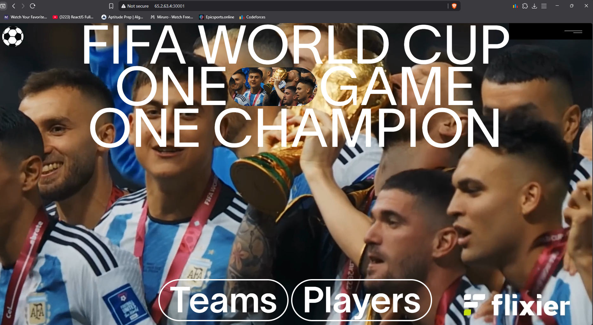
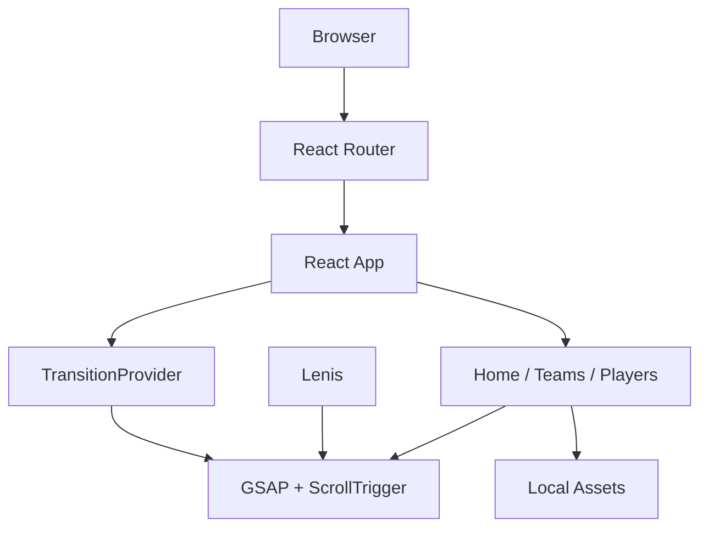

# FIFA World Cup 2026 — Animated Experience

A static, animation-led React experience built around the visual language of the FIFA World Cup. The application presents selected teams and players through full-screen video, curated imagery, interactive cards, scroll-driven scenes, and animated route transitions.

The project is intentionally client-side and asset-driven: there is no backend, database, authentication layer, or external runtime API.

## Preview

<p align="center">
  
</p>

## Overview

The application is organized around three routes:

```text
Home
  |
  +── Teams
  |
  └── Players
```

The experience combines React UI with GSAP, ScrollTrigger, and Lenis to create a navigation and scrolling system where animation is part of the interaction model rather than an isolated visual layer.

## Features

- Full-screen looping home video with large-format hero typography
- Client-side routes for Home, Teams, and Players
- GSAP five-panel route transition system
- Full-screen animated navigation
- Team-pair gallery with hover statistics
- Accessible team detail dialog
- Scroll-pinned player artwork
- Scroll-driven player image changes
- Marquee animations and hover image previews
- Lenis smooth scrolling synchronized with GSAP ScrollTrigger
- Locally bundled images, video, fonts, and graphics
- Dockerized production build served by Nginx

## Architecture



There is deliberately no API, database, socket, or server-side data layer.

```text
Development
Browser
   |
   v
Vite development server
   |
   v
React source + local assets

Production
Source
   |
   v
Vite build
   |
   v
dist/
   |
   v
Nginx
   |
   v
Browser
```

## Animation Architecture

Route navigation is coordinated through a shared `TransitionProvider`.

```text
Route control
    |
    v
playTransition(path)
    |
    v
Stairs overlay appears
    |
    v
GSAP expands five staggered columns
    |
    v
React Router navigates
    |
    v
pathname changes
    |
    v
playReveal()
    |
    v
Columns move down and reset
    |
    v
Overlay disappears
```

This keeps route choreography in one place instead of implementing separate navigation timelines inside every page.

### Scroll system

Lenis provides smooth scrolling while GSAP ScrollTrigger responds to the resulting scroll position.

```text
Browser scroll
     |
     v
   Lenis
     |
     v
GSAP ticker
     |
     v
ScrollTrigger
     |
     +── Team card expansion
     +── Player pinned scenes
     +── Scroll-driven image changes
```

## Page Structure

### Home

The landing page uses the bundled `HomeVideo.mp4` as a muted, looping background and integrates the video into the visual hero treatment.

Primary navigation controls transition to the Teams and Players experiences through the shared GSAP route transition.

### Teams

The Teams page presents paired team cards with:

- Team imagery
- Win percentage
- Trophy count
- Hover states
- Team-specific information
- Detail dialog

The selected team is kept in page-local React state. The dialog can be dismissed through the close button, backdrop, or `Escape`.

GSAP and ScrollTrigger animate card sections as they enter the scroll range.

### Players

The Players page uses scroll as part of the visual storytelling.

A pinned ScrollTrigger scene maps scroll progress to an ordered set of player artwork and changes the displayed image as the user moves through the scene.

The page also includes:

- Pinned player scenes
- Marquee animations
- Player rows
- Hover image previews

## Technology

| Area | Technology |
| --- | --- |
| UI | React 19 |
| Build tool | Vite 8 |
| Routing | React Router DOM 7 |
| Animation | GSAP 3, `@gsap/react` |
| Scroll | Lenis, GSAP ScrollTrigger |
| Styling | Tailwind CSS 4 |
| Icons | Remix Icon |
| Linting | ESLint 9 |
| Production | Docker, Nginx |
| Runtime data | Local React data and bundled assets |

## Data Model

There is no database.

The application uses fixed presentation data stored in React source files:

```text
TeamCard
├── image
├── name
├── win
└── awards

teamFacts[name]
├── code
├── nickname
└── note

PlayerCard
├── name
└── goals
```

This approach is appropriate for a fixed visual showcase. If the application evolves toward dynamic team or player data, the current architecture can be extended with structured data modules or an API layer.

## Routes

| Route | Purpose |
| --- | --- |
| `/` | Video-led landing page |
| `/teams` | Team gallery and team details |
| `/players` | Scroll-driven player experience |

The application uses `BrowserRouter`, so production hosting must support SPA history fallback for direct visits to `/teams` and `/players`.

## Project Structure

```text
2D_Animation/
├── public/
│   └── favicon / public assets
│
├── src/
│   ├── assets/
│   │   └── images, video, fonts and graphics
│   │
│   ├── components/
│   │   ├── common/
│   │   ├── home/
│   │   ├── navigation/
│   │   ├── players/
│   │   └── teams/
│   │
│   ├── context/
│   │   └── TransitionContext.jsx
│   │
│   ├── pages/
│   │   ├── Home.jsx
│   │   ├── Teams.jsx
│   │   └── Players.jsx
│   │
│   ├── App.jsx
│   ├── index.css
│   └── main.jsx
│
├── dockerfile
├── vite.config.js
├── package.json
├── ARCHITECTURE.md
└── README.md
```

## Local Development

### Requirements

- Node.js 20+
- npm
- Docker, optional

No environment variables are currently required. All displayed content and media are bundled with the application.

### Installation

```bash
git clone <repository-url>
cd WorldCup/2D_Animation
npm ci
```

Use `npm install` only when intentionally changing dependencies and updating the lockfile.

### Development server

```bash
npm run dev
```

### Production build

```bash
npm run build
```

### Preview the production build

```bash
npm run preview
```

### Lint

```bash
npm run lint
```

## Docker

Build the production image:

```bash
docker build -f dockerfile -t world-cup-animated .
```

Run the container:

```bash
docker run --rm -p 8080:80 world-cup-animated
```

Open:

```text
http://localhost:8080
```

The Docker image uses a two-stage build:

```text
Node 20 Alpine
    |
    +── npm ci
    +── npm run build
    |
    v
dist/
    |
    v
Nginx Alpine
    |
    v
Port 80
```

## Deployment Considerations

Because the application uses `BrowserRouter`, the production web server must return `index.html` when a user directly requests a client-side route such as:

```text
/teams
/players
```

The current Nginx image does not include a history-fallback configuration. A production deployment should configure Nginx accordingly.

## Accessibility and Error Handling

The application has limited asynchronous failure handling because it does not make network requests at runtime.

The team dialog includes:

- `role="dialog"`
- `aria-modal`
- An accessible label
- Descriptive image alt text
- Multiple dismissal methods
- `Escape` keyboard handling

`useTransition()` also throws an informative error when used outside `TransitionProvider`.

## Engineering Decisions

### Local assets instead of runtime content

All visual media is bundled with the application. This removes runtime content dependencies and makes the production build self-contained.

### Shared transition provider

Navigation animation is centralized in `TransitionProvider`. Pages only request navigation while the provider owns the transition timeline and router interaction.

### Local page state

The Teams page keeps `selectedTeam` locally because the state is only relevant to that page. Introducing a global state solution would add complexity without providing a meaningful benefit for the current application.

### Animation-driven interaction

GSAP is used not only for decorative effects but also for route transitions, pinned scenes, scroll progress, hover interactions, and page composition.
